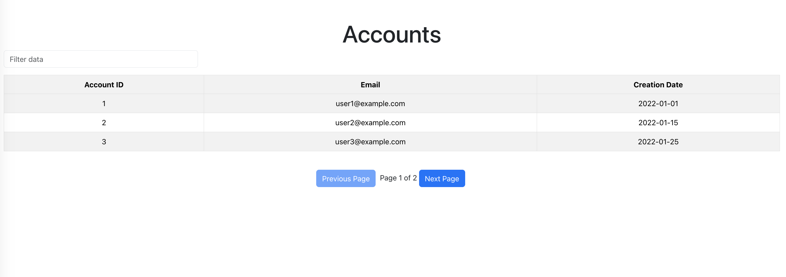

# Table



This project is a web application for displaying data in tabular form. Users can browse through the table, apply filters, and navigate between different pages.

## Table of Contents

- [Table](#table)
  - [Table of Contents](#table-of-contents)
  - [Features](#features)
  - [Technologies Used](#technologies-used)
  - [Getting Started](#getting-started)
  - [Installation](#installation)

## Features

- Display data in a table format
- Apply filters to the table data
- Navigate between different pages of the table

## Technologies Used

- React.js: JavaScript library for building user interfaces.
- TypeScript: Adds static typing to JavaScript, enhancing code scalability and readability.
- react-router-dom: Library for managing navigation in React applications.
- react-bootstrap: Bootstrap components adapted for use in React applications.
- react-loader-spinner: Animated loading indicators for enhanced user experience.
- react-query: Library for managing and caching server state in React applications.
- axios: Promise-based HTTP client for making requests to your API.
- mockapi.io: Mock API for simulating backend data.
- eslint: Tool for identifying and reporting patterns found in ECMAScript/JavaScript code.
- prettier: Code formatter ensuring consistent code style across the project.

## Getting Started

To get started with this project, follow the installation instructions below.

## Installation

1. Clone the repository:

   ```bash
   git clone https://github.com/samusdimitriy/table.git
   cd table-app
   ```

2. Install the dependencies:
   ```bash
   npm install
   ```
3. Start the development server:
   ```bash
   npm start
   ```
4. Open
   [https://samusdimitriy.github.io/table/](https://samusdimitriy.github.io/table/)
   to view it in the browser.

5.License This project is licensed under the MIT License - see the LICENSE file
for details.
